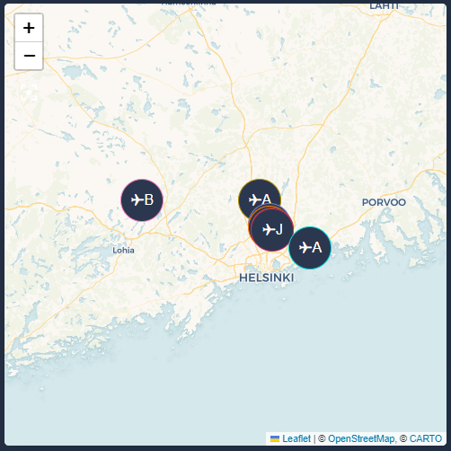

# FlightRadar24 proxy by [@jesmak](https://www.github.com/jesmak)

A Node based proxy app to convert data from [home-assistant-flightradar24](https://github.com/AlexandrErohin/home-assistant-flightradar24) custom integration to GeoJSON format.

## What is it?

A proxy application that requests FlightRadar24 data from Home Assistant's API and converts it to GeoJSON format to be used by Home Assistant's [GeoJSON integration](https://www.home-assistant.io/integrations/geo_json_events/).

## Options (config.json)

| Name           | Type    | Requirement  | Description                                       | 
| ---------------| ------- | ------------ | ------------------------------------------------- | 
| API_URL        | string  | **Required** | URL pointing to FR24 sensor's API endpoint        | 
| TOKEN          | string  | **Required** | API token from Home Assistant                     | 

## How to install

Download the latest release package and run it in a Node environment. For reference, here is a guide for running the app in a Docker container.

1. Extract the release package to a folder of your choosing
2. Modify config.json to match your environment (point the API URL to your FR24 sensor and insert an API token). You can create the API token in HASS by opening your profile (by clicking your profile pic) and scrolling all the way down, from where you can create a token.
3. Install node modules by running `npm install` in the same folder you extracted the release package to
4. Modify docker-compose.yaml to match your environment (should be fine without changes if port 8081 is ok for you)
5. Start the app by executing `docker compose up -d` in the same folder

Obviously you need to have NodeJS and Docker installed for the above to work.

## Configure Home Assistant

1. Open integrations and add a new GeoJSON integration. Insert an URL matching the Node service you just created, for example `http://your.node.server:8081/`. Also set the location and radius. These should pretty much match what you've already set to the FR24 integration.
2. Default update interval is 5 minutes. If that is fine with you, you can skip this and the next step. Otherwise, open the settings of this newly configured integration and disable automatic updates.
3. Create a new automation to periodically run an update for the new integration. Here is the yaml for such an automation that updates every 30 seconds:

```
description: ""
trigger:
  - platform: time_pattern
    hours: "*"
    minutes: "*"
    seconds: /30
condition: []
action:
  - service: homeassistant.reload_config_entry
    target: {}
    data:
      entry_id: 9506910978c053b5ff8ec916067b1103
mode: single
```
You can find the entry_id from /config/.storage/core.config_entries file, you need to use File Editor addon or similar tool to access it.


4. Add a map card to your dashboard. Here is an example yaml for one:

```
type: map
geo_location_sources:
  - geo_json_events
```

And here is the end result:


